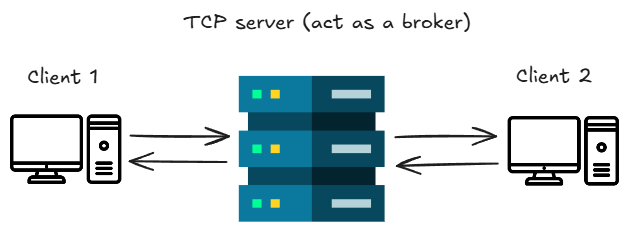
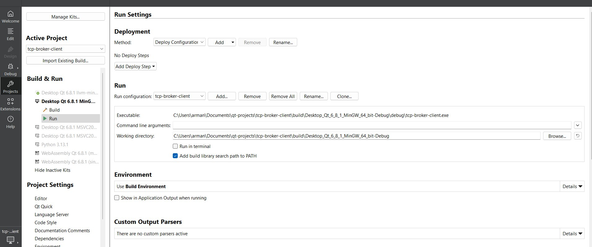
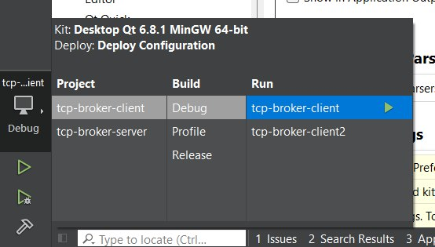
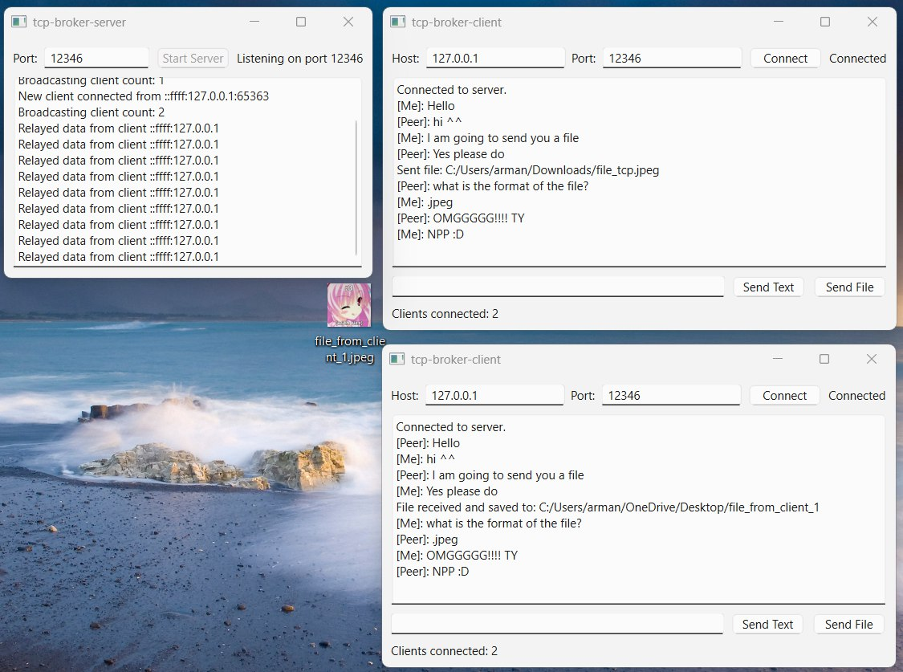

# TCP broker client

This is a client part of a TCP server project written in C++ using Qt framework.

The server part is here: https://github.com/breadx333/tcp-broker-server

Project can establish connection between two or more users and let exchange text and any file type content.

The server part act as a broker/intermediary between clients as in the image below

To run the app
1. Open the project with Qt Creator app
2. Run .qmake (.pro) file to configure makefiles
3. Build & Run
4. Specify the host address and it's port
5. Connect to the TCP server by clicking Connect button
6. Now you are ready to communicate

If you want to create multiple client instances, do this

1. Go Projects -> Build & Run -> Run -> Add (in Run section) -> Select the project
2. Run the instances simultaneously

In the end you will get

